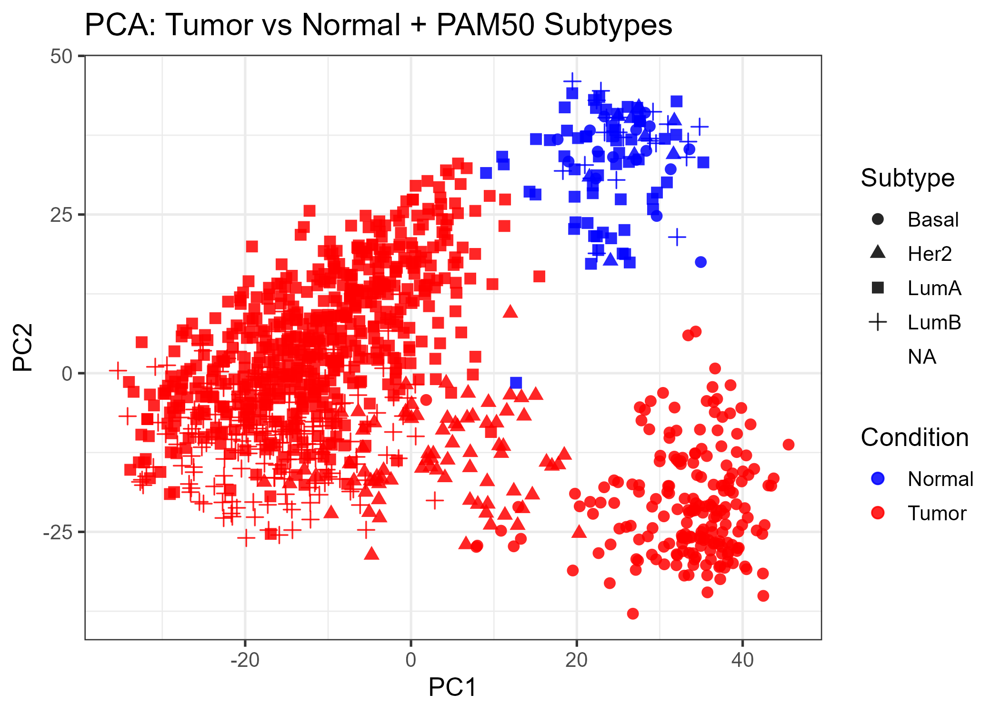

# TCGA-BRCA Pipeline for Dual CAR-NK Therapy


### A complete reproducible workflow for subtype-specific differential expression, surfaceome filtering and co-expression analysis


---


## 📌 Overview


This repository contains a fully reproducible **R pipeline** developed to identify subtype-specific antigen pairs for potential **Dual-CAR NK cell targeting in breast cancer**.


The workflow integrates:


- TCGA-BRCA RNA-Seq (STAR-Counts)  

- PAM50 molecular subtypes  

- Differential expression (**DESeq2**)  

- Human Protein Atlas (**HPA**) surfaceome filtering  

- External GEO validation datasets  

- Pearson-based co-expression network construction  


**Goal:** Narrow down high-confidence co-expressed surface gene pairs that are highly expressed in tumor, low in normal tissues and subtype-specific.


---


## 🔬 Biological Background


Modern NK cell engineering uses CAR receptors targeting tumor antigens.  

However:


- Many breast cancer antigens are heterogeneous  

- Single target CAR therapy often fails due to antigen escape  

- Dual-CAR logic solves this by activating NK cells only when **two antigens are co-expressed** on the same tumor cell, improving specificity and reducing off-tumor toxicity  


This pipeline identifies a pair of co-expressed surface antigens for each BRCA subtype by combining **TCGA expression, HPA surface localization and correlation networks**.


---


## 🎯 Objectives


- Identify Differentially Expressed Genes (DEGs) for each BRCA subtype vs normal tissue  

- Filter DEGs to surfaceome proteins using HPA Subcellular Data  

- Validate subtype-specific DEGs using independent GEO datasets  

- Construct co-expression networks and rank antigen pairs for dual-CAR NK targeting  


---


## 🚀 Complete Pipeline Steps


Each step below is fully reproducible and explained in beginner friendly manner.


### 1️⃣ Data Download – TCGA-BRCA (STAR Counts)

- Use **TCGAbiolinks** to directly download raw count data from the GDC

- [GDC Data Transfer Tool v2.3.0](https://gdc.cancer.gov/access-data/gdc-data-transfer-tool) was used to get the raw data 

- Transcriptome Profiling → Gene Expression Quantification → STAR-Counts workflow  


**Outputs:**  

✔ counts matrix (60660 genes × 1231 samples)  

✔ sample_info metadata  

✔ gene_info annotations  


**Why STAR-Counts?**  

Because STAR performs accurate alignment and TCGA uses it as the standardized pipeline.


---


### 2️⃣ Preprocessing & Cleaning

✔ Keep only Primary Tumor + Solid Tissue Normal  

✔ Standardize barcodes  

✔ Remove gene versions (e.g., `ENSG000001.1 → ENSG000001`)  

✔ Filter for protein-coding genes  

✔ Remove low-expressed genes  

✔ Ensure meta and counts align perfectly  


**Output:**  

`results/01_preprocessed/sample_info_tumor_normal.csv`


---


### 3️⃣ Add PAM50 Subtypes

- Annotate samples with PAM50 subtypes: **LumA, LumB, Her2, Basal**  


**Output:**  

`results/02_metadata/TCGA_BRCA_metadata_final.csv`


---


### 4️⃣ Differential Expression (DESeq2)

For each subtype:  

**Tumor (that subtype) vs All Normals**


**Steps:**

- DESeq2 normalization  

- Wald test  

- Fold-change shrinkage (**ashr**)  

- Filter: `padj < 0.05 & |log2FC| ≥ 1`  


**Outputs:**  

- `results/03_DESeq2_raw/`  

- `results/04_DESeq2_filtered/`  


---


### 5️⃣ VST Normalization & QC

✔ Variance Stabilizing Transformation  

✔ PCA plots to verify tumor vs normal separation  

✔ Subtype clustering check  


**Output:**  

`results/QC/PCA_Condition_Subtype_manual.png`



---


### 6️⃣ Gene Annotation

- Map **Ensembl IDs → Gene Symbols**  

- Add Biotype information  


**Output:**  

`results/02_metadata/TCGA_gene_annotation.csv`


---


### 7️⃣ HPA Surfaceome Filtering

- Used **Human Protein Atlas v24.1 → Subcellular Location data**  

- File `results/subcellular_location.tsv` downloaded from [Human Protein Atlas](https://www.proteinatlas.org/about/download)

- Filters:  

- MAIN LOCATION ∈ {Plasma membrane, Cell Junctions, Primary Cilium, etc.}  

- RELIABILITY ≠ Uncertain  

  - Filtered list  `results/hpa_filtered.csv`


**Rationale:**  

CAR receptors can target **only surface antigens** → remove all non-surface DEGs.


---


### 8️⃣ GEO Validation (External Dataset)

- Validate each subtype using matched GEO dataset (LumA → GSE86374, LumB → GSE86374, HER2 → GSE29431, Basal → GSE86374)  

- Run GEO2R → Extract DEGs → Intersect with TCGA DEGs → Intersect with surfaceome list  


**Output:**  

`results/HPA_intersected/`
`results/Venn diagrams/`


---


### 9️⃣ Prepare Clean VST Expression Matrix

✔ Remove NA subtypes  

✔ Correct subtype labels  

✔ Merge annotation  

✔ Collapse duplicate gene symbols  

✔ Create clean `vsd_clean` matrix  


---


### 🔟 Co-Expression Analysis (Pearson)

**Goal:** Identify pairs of surface genes co-expressed in all the subtypes samples.  


Steps:

- Extract subtype expression  

- Keep only HPA-filtered surface genes  

- Compute Pearson correlation  

- Remove duplicates & self-pairs  

- Rank pairs  

- Filter: `|r| ≥ 0.7`  


**Outputs:**  

- `results/07_coexpression`  

- `results/08_pairs`


---


## 📊 Example Outputs

- Co-expression histogram → `results/07_coexpression`  

- Top-ranked pairs (Dual-CAR candidates):  


| Gene1 | Gene2 | Correlation |
|-------|-------|-------------|
| X     | Y     | 0.93        |
| A     | B     | 0.90        |


---


## 🧩 Notes, Rationale & FAQ


### ❓ Why intersect TCGA with GEO

- TCGA alone may contain batch effects, patient-specific noise, subtype imbalance  

- GEO intersection ensures replication, subtype-specific signals and higher confidence  


### ❓ Why use HPA “Subcellular Location”

- CAR molecules target **surface-exposed antigens**  

- HPA MAIN LOCATION field provides experimentally verified plasma membrane, junctions, cilium domains  


### ❓ Why Pearson correlation

- TCGA VST-normalized data are continuous/parametric  

- Pearson captures linear co-expression  

- Widely used in TCGA/GTEx/WGCNA studies  


### ❓ Why subtype-wise DESeq2

- BRCA subtypes have distinct biology and antigenic profiles  

- Therapy must be subtype-optimized to avoid off-target toxicity  


### ❓ Why |LFC| ≥ 1

- Ensures biologically meaningful regulation  

- Avoids noise from borderline DEGs  


### ❓ Why correlation threshold |r| ≥ 0.7

- Strong biological co-expression  

- Reflects co-regulation probability  

- Standard in network biology  


---


## 📌 How to Reproduce This Pipeline


```bash

# Clone the repository

git clone https://github.com/CH1NMAY117/TCGA-BRCA-pipeline

cd TCGA_BRCA


# Open the main file

Script.rmd


# Run all chunks sequentially in RStudio

```

